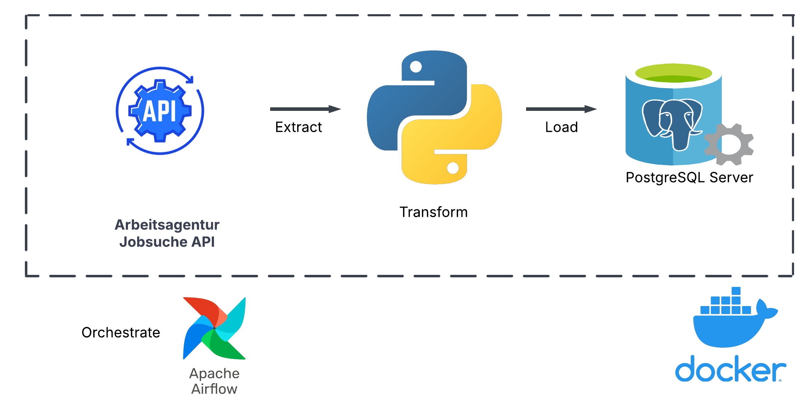

# JOB SEARCH TRACKER 

This repository contains a data engineering project that implements an ETL (Extract, Transform, Load) data pipeline. The goal of project is to collect data from Arbeitsagentur Jobsuche API, process data through scheduled tasks which are orchestrated by Airflow and then store data in relation database to keep track of new posting jobs. 
> **Source API:** https://jobsuche.api.bund.dev/ 

## Data Workflow
1. Collect data from open source API
2. Transform data from JSON format to structured dataset CSV
3. Import CSV table into Postgres  

Apache Airflow and Postgres SQL are set up in Docker container.

## Technology Stack
- PostgresSQL: An open-source relational database management system
- Apache Airflow:  An open-source platform for developing, scheduling, and monitoring batch-oriented workflows
- Docker: An open platform for developing, shipping, and running applications
  
## Project Structure
* dags: contains defined DAG for scheduling ETL jobs
* data: updated table tracking 55 lastest jobs

